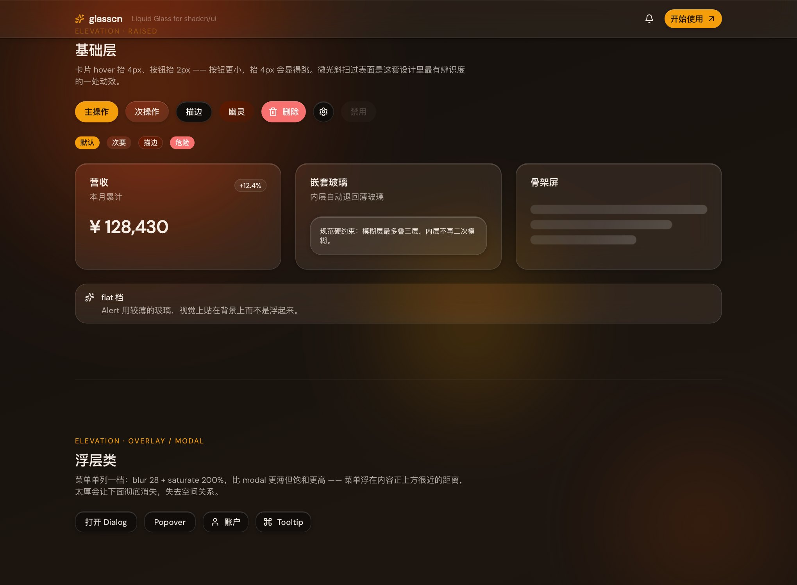
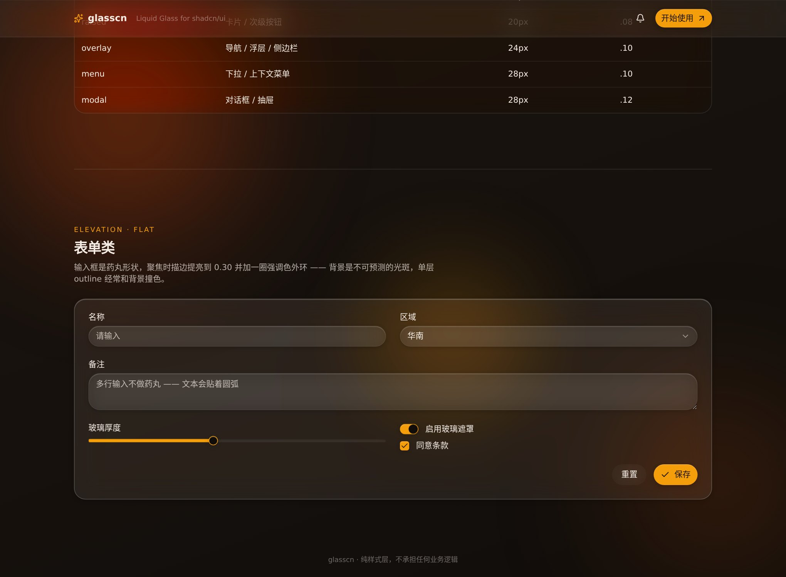

# glasscn

shadcn/ui 的 Liquid Glass 主题层。暗色优先，纯 CSS，零运行时，不承担任何业务逻辑。

[](https://github.com/jint2020/shadcn-glasscn/actions/workflows/ci.yml)
[](./LICENSE)
[](https://tailwindcss.com)

**[在线预览 →]([https://jint2020.github.io/shadcn-glasscn/](http://jint2020.github.io/shadcn-glasscn/))**

<table>
<tr>
<td width="50%"></td>
<td width="50%"></td>
</tr>
<tr>
<td align="center"><sub><code>unified-theme</code> · 默认</sub></td>
<td align="center"><sub><code>density-axis</code> · sheer / frosted / heavy</sub></td>
</tr>
</table>

---

## 核心规则

> **玻璃没有自己的颜色。**
>
> 它的颜色全部来自背后的背景，经过模糊和提亮之后透出来。
> 设计活在背景里，玻璃只是把它温柔地显出来。

所以玻璃填充永远是 `rgba(255,255,255,N)` —— 白色中性，绝不带色调。
想换整体气质，换的是背后光斑的颜色，不是玻璃的颜色。

这条一破，玻璃立刻变成"有色半透明塑料片"。库里有两道自动闸挡它：
`pnpm verify` 断言统一主题下玻璃填充保持白中性，CI 另外扫一遍 registry 产物
里所有 `--glass-fill*` 变量，出现颜色值就让构建失败。

---

## 三种用法，按侵入程度递增

### 1. 零侵入（推荐起点）

```css
/* globals.css */
@import "tailwindcss";
/* ... 你原有的 shadcn 变量 ... */
@import "glasscn-core"; /* ← 加这一行 */
```

```html
<body class="glass-backdrop">
```

shadcn 的每个组件都会输出 `data-slot` 属性。glasscn 挂在这些属性上，
把已有组件就地变成玻璃——不用重新 `shadcn add`，不用改一行 tsx。

### 2. 显式工具类

```html
<div class="glass-surface glass-overlay glass-interactive glass-shimmer glass-ring">
  自定义组件也能用同一套材质
</div>
```

### 3. registry（不装 npm 包）

```bash
shadcn registry add @glasscn=https://jint2020.github.io/shadcn-glasscn/r/{name}.json
shadcn add @glasscn/glass-theme
```

| item | 内容 |
|---|---|
| `glass-theme` | 主题本体：材质变量 + shadcn 自动桥 + 降级层 |
| `glass-core` | 把完整 CSS 层复制进项目（不走 npm 依赖） |
| `use-glass-reveal` | 滚动揭示的老浏览器兜底 |
| `use-glass-tilt` | 3D 倾斜（Expressive 档） |
| `use-glass-perf` | 帧率探测，掉帧自动降级 |

> 装完 `glass-theme` 记得补一行 `@import "./glass-fallback.css";` ——
> 降级层是 `@media`/`@supports` 顶层规则，必须落在 unlayered 作用域才压得过
> `cssVars`，所以走的是 `files` 而不是 `css` 字段，CLI 不会自动加这行 import。

---

## 设计要点

### 高度阶梯，不是一档模糊套所有

真实玻璃离背景越远，透过它看到的东西越糊。所有组件用同一档模糊，画面就是平的。

| 档位 | 组件 | 模糊 | 填充 |
|---|---|---|---|
| `base`（兼容 `flat`） | Input / Badge / Table | 15.84px | .08 |
| `raised` | Card / 次级按钮 / Alert | 18px | .10 |
| `floating`（兼容 `overlay`） | 导航 / Popover / Sidebar / 菜单 | 23.04px | .14 |
| `modal` | Dialog / Sheet / Command | 25.92px `saturate 190%` | .18 |

改 `--glass-blur-base` 一个值，整套等比缩放。

菜单单列一档不是随手加的：它浮在内容正上方很近的距离，用 modal 那么厚会让
下面的内容彻底消失，失去空间关系；但它又需要更高的饱和来把背景的颜色提出来。

### backdrop-filter 里必须有 saturate

```css
backdrop-filter: blur(20px) saturate(180%);
```

只有 `blur` 的玻璃看起来像磨砂塑料。`saturate` 让透过玻璃的颜色"绽"出来，
这才是玻璃感的真正来源。

### 1px 顶边高光不可省

```css
box-shadow: 0 1px 0 0 rgba(255,255,255,0.20) inset;
```

它是"真玻璃"和"一块模糊的板子"之间唯一的区别——模拟玻璃的物理厚度接到顶光。
去掉之后面板会立刻变平，但不看侧光很难发现，所以 `pnpm verify` 会断言它常驻。

### 主操作是实心的，次操作才是玻璃

一屏全是半透明面板时，主按钮再做成玻璃，用户就找不到"该点哪个"。
这是可供性问题，不是审美偏好。禁用态也一样——只降 opacity 的话，
0.45 的琥珀还是一块醒目的暖色块，读作"可以点，只是颜色淡了些"。
所以禁用时先褪成玻璃再谈透明度。

### 药丸是形状签名

按钮、输入框、徽章、标签一律 999px。不是方角，也不是"稍微圆一点"。
多行输入例外——文本会贴着圆弧，用卡片圆角。

### 玻璃需要背后有东西

纯色背景上的玻璃就是一个灰框。三团光斑各自缓慢漂移，只动 `transform`：

```html
<body class="glass-backdrop">
  <main class="glass-blob-accent"> <!-- 第三团光斑 -->
```

绝不动 `color` 或 `filter`——那些属性每帧都要重新光栅化整块模糊。

---

## 统一主题（替代 palette 体系）

新版默认就是统一玻璃主题，不再把 palette 作为主路径。  
若历史项目仍设置了 `data-glass-palette`，会进入兼容层并回落到统一主题，不再分叉视觉。

另有一条独立于调色的通透度轴：

```ts
document.documentElement.dataset.glassDensity = "sheer" // sheer | frosted | heavy
```

---

## 字体

只定义 token，不加载字体。

主题层里塞 Google Fonts 的 `@import` 会让每个使用方都多一个跨域阻塞请求
（国内网络尤其明显），而且没法退。所以字体由你自己引，库里给出完整 fallback 栈，
不引也不会崩，只是落到系统字体。

```html
<link rel="preconnect" href="https://fonts.gstatic.com" crossorigin>
<link rel="stylesheet" href="https://fonts.googleapis.com/css2?family=Outfit:wght@600;700;800&family=DM+Sans:wght@400;500&display=swap">
```

自托管或用国内 CDN 时，把 `--glass-font-heading` / `--glass-font-body`
的第一项换掉即可，别的不用动。

---

## 降级与无障碍

`backdrop-filter` 一旦不生效，`rgba(255,255,255,0.08)` 的面板就变成
"几乎看不见的框"，文字直接压在动画光斑上——不可读。
所以降级不是锦上添花，是能不能上生产的分界线。

| 触发条件 | 行为 |
|---|---|
| `@supports not (backdrop-filter)` | 退到近不透明暗底 |
| `prefers-reduced-transparency` | 完全不透明、关模糊，光斑压暗但保留 |
| `prefers-contrast: more` | 描边加强、微光关闭、文字提亮 |
| `prefers-reduced-motion` | 动画归零，揭示元素立即可见 |
| `@media print` | 白底无模糊，**强制揭示元素可见** |
| `[data-glass-perf="lite"]` | 整棵子树退回纯色，布局不变 |

打印那条容易漏：打印不产生滚动，scroll-driven 的揭示动画时间轴永远停在起点，
不处理的话整页会以 `opacity: 0` 印出来——一张白纸。同样的坑还有打印预览、
无头截图服务、部分爬虫。

降级层整层带 `!important`，因为它需要稳压组件层和运行时状态，
保证无障碍降级不会被静默压掉。

---

## 性能

`backdrop-filter` 是逐帧重绘的合成层。三条硬约束：

- **模糊层最多叠三层**。嵌套玻璃自动退回薄玻璃（保留填充和棱边，去掉背景模糊）
- **选择器名单手工挑选**，不用 `[data-slot]` 通配——通配会让长列表里每个 cell 都起合成层
- **列表项和表格行只换填充**，不做位移也不做模糊

`useGlassPerf()` 采样帧率，低于阈值就在 `<html>` 挂 `data-glass-perf="lite"`。

---

## 按需引入

Tailwind v4 只输出实际用到的 `@utility`，工具类天然 tree-shake。
CSS 层按目录粒度拆分：

```css
@import "glasscn-core/headless";              /* 只要工具类，不自动接管 */
@import "glasscn-core/tokens/primitives.css"; /* 只要材质变量 */
@import "glasscn-core/primitives/surface.css";
```

---

## 目录结构

```
packages/core/src/
├── tokens/
│   ├── primitives.css    材质原语（白色玻璃 / 模糊 / 高光 / 运动 / 圆角）
│   ├── palette.css       统一玻璃主题（背景/光斑/强调色）
│   ├── elevation.css     三档语义层级 + 兼容别名
│   ├── typography.css    字体 token（不加载字体）
│   └── bridge.css        shadcn 变量接管 + 阴影量表
├── primitives/
│   ├── surface.css       glass-surface / nav / menu / premium / 通透度轴
│   ├── interaction.css   hover / active / focus / 微光扫过 / 实心 CTA
│   ├── backdrop.css      三团光斑背景
│   ├── reveal.css        滚动揭示 + 骨架屏
│   └── fallback.css      六条降级路径
├── bridge/auto.css       data-slot 零侵入层
└── palettes/             legacy 兼容层（已弃用）

packages/registry/        registry 生成器（从 CSS 反推，不手抄）
apps/playground/          预览站
```

---

## 自托管

推到 GitHub、开 Pages、日常维护与排错，见 **[self-managed.md](./self-managed.md)**。

## 开发

```bash
pnpm install
pnpm exec playwright install chromium   # verify 要用，装一次

pnpm dev                 # 预览站
pnpm build               # 构建预览站
pnpm registry:build      # 生成 registry 产物
pnpm verify              # 37 项浏览器断言
pnpm screenshot          # 重新生成 docs/screenshots/
```

`pnpm verify` 是这套库的安全网。玻璃拟态有四处特别容易骗过肉眼：

- **填充悄悄带上色调** —— 最核心的一条规则，肉眼几乎看不出来
- **换调色时玻璃跟着变色** —— 说明颜色没走光斑，模型塌了
- **顶边高光丢失** —— 面板会变平，但不看侧光很难发现
- **对比度看着还行实际不达标** —— 玻璃是合成出来的，`getComputedStyle`
  拿到的是半透明源色，量不出真实值，所以测试直接截图采真实渲染像素
